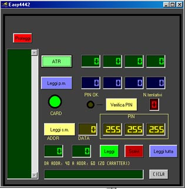



## Easy SLE4442

### Description

I think this is the first example on PSC of managing Smart Card reader and memory card handling. It's my first submission, a few line of code but with great contents. It's anx OCx to manage read/write of an SLE4442 memory card with a RS232 generic smart card reader. Code is full implemented with basic functions and is a great HOWTO for MSCOmm programmers. To see it works you must have a rs232 smart card reader(for my work I tried with ELV reader www.elv.de). Sorry, the code is well commented but in Italian. Vote for me and make me a winner!! Also I hope this can help developers community.
 
### More Info
 

             |
---                |---
**Submitted On**   |2001-02-11 10:02:48
**By**             |[Eudosia\-Systems](https://github.com/Planet-Source-Code/PSCIndex/blob/master/ByAuthor/eudosia-systems.md)
**Level**          |Advanced
**User Rating**    |4.3 (17 globes from 4 users)
**Compatibility**  |VB 6\.0
**Category**       |[OLE/ COM/ DCOM/ Active\-X](https://github.com/Planet-Source-Code/PSCIndex/blob/master/ByCategory/ole-com-dcom-active-x__1-29.md)
**World**          |[Visual Basic](https://github.com/Planet-Source-Code/PSCIndex/blob/master/ByWorld/visual-basic.md)
**Archive File**   |[Easy\_SLE441574474162003\.zip](https://github.com/Planet-Source-Code/eudosia-systems-easy-sle4442__1-44775/archive/master.zip)

